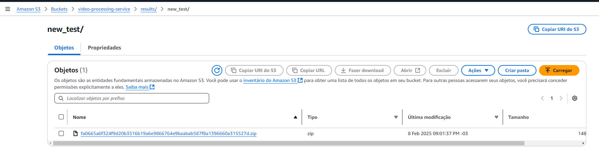
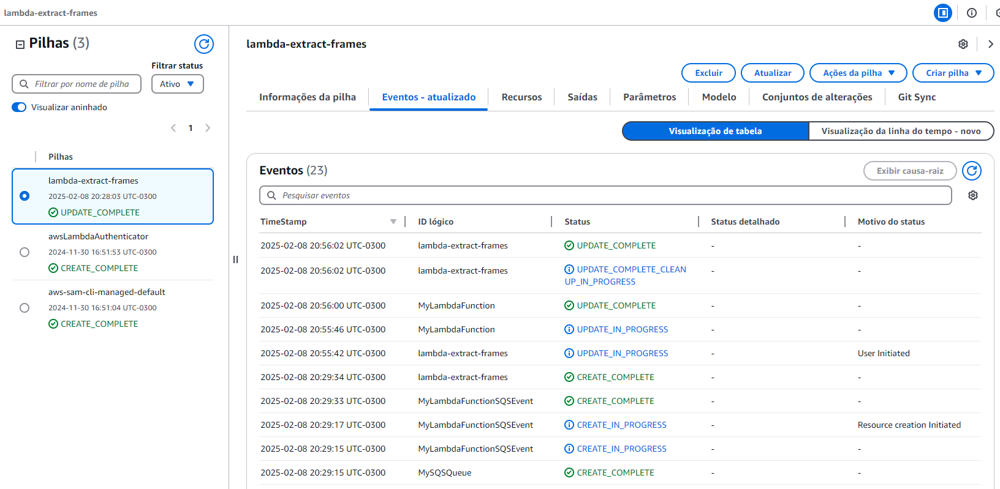
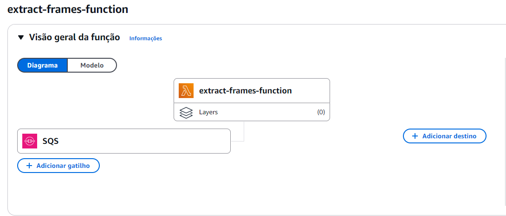
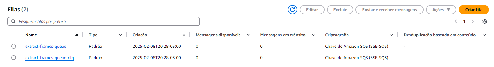

# Extract Frames
Este é um projeto desenvolvido em Python 3.12 com o objetivo de extrair frames de um vídeo. O usuário pode especificar um intervalo de tempo (início e fim) e a quantidade de frames a serem pulados durante a extração.

## Objetivo
O projeto permite a extração de frames de um vídeo conforme as preferências do usuário. Ele utiliza o padrão *Saga Pattern* para controlar o fluxo de execução da função Lambda. Caso ocorra algum erro, o sistema envia uma notificação ao usuário, informando que a requisição falhou. Além disso, um banco de dados DynamoDB é utilizado para gerenciar o fluxo de status, além de armazenar informações para futuras consultas.

### Status no Saga Pattern:
- **START_PROCESS**: A Lambda foi acionada.
- **DOWNLOAD_VIDEO_IN_PROGRESS**: O vídeo está sendo baixado para processamento.
- **PROCESSING_CUT_FRAMES**: O vídeo está sendo processado para extrair os frames.
- **ZIP_FILE_IN_PROGRESS**: O arquivo está sendo compactado para envio ao S3.
- **UPLOAD_RESULT_IN_PROGRESS**: O arquivo está sendo enviado para o S3.
- **END_PROCESS**: O processo foi concluído com sucesso.

Em caso de erro, o status será alterado para:
- **ERROR**: Ocorreu um erro durante a execução da Lambda.


Como mencionado, o usuário pode solicitar um corte de vídeo especificando o tempo de início e fim, além da quantidade de frames a serem pulados. Para isso, o usuário deve enviar um JSON com as seguintes informações:
```json
{
    "user": "user",
    "video_name": "video_name",
    "start_time": 0,
    "end_time": 0,
    "skip_frames": 1
}
```

Todos os frames extraídos são salvos em um arquivo compactado (ZIP), que é enviado para o S3. O nome do arquivo gerado inclui o nome do usuário, a data e hora da execução, e o nome do vídeo, tudo em um hash para garantir a unicidade e evitar sobrescrições.- 

````python
generate_hash(f'{self.user}-{self.datetime_aux}-{self.video_name}')
````

##  Executando a Aplicação
#### Requisitos

- Python 3.12
- pip

#### Instalação
Para instalar as dependências necessárias, execute o seguinte comando apontando para o arquivo requirements.txt:
```bash
pip install -r requirements.txt
````    

OBS: Caso haja alterações no projeto, é importante atualizar as dependências. Para isso, use o comando:
````
pip freeze > requirements.txt
````

####  Execução
Para executar a aplicação, use o comando:

```bash
python src/app.py
````

##  Testes Unitários
A aplicação inclui testes unitários, localizados na pasta tests. Esses testes utilizam o pytest e o pytest-cov para análise de cobertura de código. Para rodá-los, instale as dependências necessárias:
````    
pip install pytest
pip install pytest-cov
````

Para verificar a cobertura do código localmente, execute o comando abaixo:
````
coverage3 run -m pytest -v --cov=. 
````

Para verificar os testes no SonarQube, execute os comandos do coverage para gerar o arquivo coverage.xml e depois rode o sonar-scanner:
````
coverage3 run -m pytest -v --cov=. --cov-report xml:coverage.xml
sonar-scanner
````

## Deploy na AWS
Para realizar o deploy na AWS, utilizamos o AWS SAM CLI (Serverless Application Model). O AWS SAM CLI facilita o processo de build e deploy de aplicações serverless.

Comando para realizar o build da aplicação:
````bash
sam build --no-cached --debug
````
Comando para realizar o deploy da aplicação:
````bash
sam deploy --stack-name lambda-extract-frames --no-confirm-changeset --no-fail-on-empty-changeset --capabilities CAPABILITY_IAM
````
- CloudFormation::


- Lambda


- SQS



